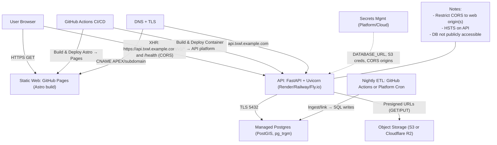

## Production deployment wireframe

### Quick path overview

- **Frontend (Astro)**: GitHub Pages (static), optional custom domain
- **API (FastAPI)**: managed container host (Render/Railway/Fly.io)
- **Database**: managed Postgres with PostGIS and `pg_trgm` (Neon/CrunchyBridge)
- **Object storage**: S3 or Cloudflare R2 for reports/artifacts
- **CI/CD**: GitHub Actions builds Pages and deploys API container; secrets in repo envs + platform secrets

### Architecture



### Deployment checklist

1) DNS and domains
- **Web**: `txwl.example.com` → GitHub Pages (or keep `https://<org>.github.io/<repo>/`).
- **API**: `api.txwl.example.com` → platform service URL (CNAME). Enable TLS, HSTS.

2) Database (Neon or CrunchyBridge)
- Create project `txwl`, DB `txwl`.
- Create app user with least privilege; restrict network to API egress where possible.
- Enable extensions:
  - `CREATE EXTENSION IF NOT EXISTS postgis;`
  - `CREATE EXTENSION IF NOT EXISTS pg_trgm;`
- Apply schema/init SQL from `db/init/` (order: `01_postgis.sql`, `02_gwdb.sql`, `02_gwdb_links.sql`, `03_well_reports_fix.sql` if needed).
- Store `DATABASE_URL` (e.g., `postgresql://<user>:<pass>@<host>:5432/<db>`).

3) Object storage (S3 or Cloudflare R2)
- Create bucket `txwl-reports-prod` (per‑env).
- Enable encryption at rest; set lifecycle policy if desired.
- Create limited-access credentials; store in API platform secrets:
  - `S3_ENDPOINT` (if R2), `S3_BUCKET`, `S3_REGION`, `AWS_ACCESS_KEY_ID`, `AWS_SECRET_ACCESS_KEY`.

4) API service (Render example)
- New Web Service → “Use existing Dockerfile” pointing to `apps/api/`.
- Environment variables:
  - `PORT` (platform provided). Start command: `uvicorn app.main:app --host 0.0.0.0 --port $PORT`.
  - `DATABASE_URL` (from step 2).
  - `ALLOWED_ORIGINS` = `https://txwl.example.com,https://<org>.github.io/<repo>`.
  - Optional: `ENV=production`, S3/R2 variables from step 3.
- Health check: `/health`.
- Scale: 1 instance; autoscale 1→3; region near TX users.
- Logs/alerts: error rate, p95 latency.

5) Frontend (GitHub Pages)
- Ensure Pages workflow builds `apps/web` with:
  - `PUBLIC_BASE_PATH`:
    - Custom domain → `/`
    - Project pages → `/<repo>/`
  - `PUBLIC_API_URL` = `https://api.txwl.example.com/`
- Publish `dist/` to Pages. Cache `apps/web/package-lock.json`.

6) CORS and security
- API must restrict CORS to your web origin(s) (replace wildcard in `apps/api/app/main.py`).
- Force HTTPS on API (platform), enable HSTS.
- DB not publicly accessible; prefer VPC/privatelink if available.

7) Nightly ingest (Sprint 7)
- Add a nightly GitHub Actions workflow or platform cron to run `data/jobs/nightly_snapshots.py` against prod DB. Use OIDC or a dedicated service token.

8) Post‑deploy validation
- `curl -s https://api.txwl.example.com/health` → `{"ok": true}`
- Visit site; “API status: ok”.
- Search returns DB items (not just stub).
- If reports are enabled later, verify presigned URLs download from object storage.

### Minimal code/config adjustments (reference)

Frontend status widget should use `PUBLIC_API_URL` as base when no dev proxy is available (Pages):

```html
<script>
  const controller = new AbortController();
  const timeout = setTimeout(() => controller.abort(), 1500);
  const base = window.__tx_api || '';
  const url = base ? new URL('health', base).toString() : new URL('/health', window.location.origin).toString();
  fetch(url, { signal: controller.signal, cache: 'no-store' })
    .then((r) => (r.ok ? r.json().catch(() => ({ ok: false })) : { ok: false }))
    .then((data) => {
      const el = document.getElementById('api-status');
      if (!el) return;
      const ok = Boolean(data && data.ok);
      el.innerHTML = `<small>API: ${ok ? 'ok' : 'offline'}</small>`;
    })
    .catch(() => {
      const el = document.getElementById('api-status');
      if (!el) return;
      el.innerHTML = '<small>API: offline</small>';
    })
    .finally(() => clearTimeout(timeout));
}</script>
```

API CORS should be driven by env (example):

```python
allowed_origins = [o.strip() for o in os.getenv("ALLOWED_ORIGINS", "").split(",") if o.strip()] or ["http://localhost:4321"]
app.add_middleware(
    CORSMiddleware,
    allow_origins=allowed_origins,
    allow_credentials=True,
    allow_methods=["*"],
    allow_headers=["*"],
)
```

Pages workflow (example) setting build‑time envs:

```yaml
name: Deploy Pages
on:
  push:
    branches: [main]
permissions:
  pages: write
  id-token: write
jobs:
  build:
    runs-on: ubuntu-latest
    defaults:
      run:
        working-directory: apps/web
    steps:
      - uses: actions/checkout@v4
      - uses: actions/setup-node@v4
        with:
          node-version: 20
          cache: npm
          cache-dependency-path: apps/web/package-lock.json
      - run: npm ci
      - env:
          PUBLIC_BASE_PATH: /
          PUBLIC_API_URL: https://api.txwl.example.com/
        run: npm run build
      - uses: actions/upload-pages-artifact@v3
        with:
          path: apps/web/dist
  deploy:
    needs: build
    runs-on: ubuntu-latest
    environment:
      name: production
    steps:
      - id: deployment
        uses: actions/deploy-pages@v4
```

### Env/secret matrix (prod)

- **Frontend (build‑time)**: `PUBLIC_BASE_PATH`, `PUBLIC_API_URL`
- **API (runtime)**: `DATABASE_URL`, `ALLOWED_ORIGINS`, optional S3/R2 creds
- **CI/CD**: tokens for Pages (OIDC), API platform deploy token if used

### Alternatives

- **Web**: Cloudflare Pages (set `PUBLIC_API_URL`; simple custom domain + CDN)
- **API**: Railway/Fly.io; same envs/health check
- **DB**: AWS RDS (PostGIS); ensure network security groups

This plan enables the static site to call a real API under a custom domain with a managed database and secure CORS, while keeping ops minimal.


